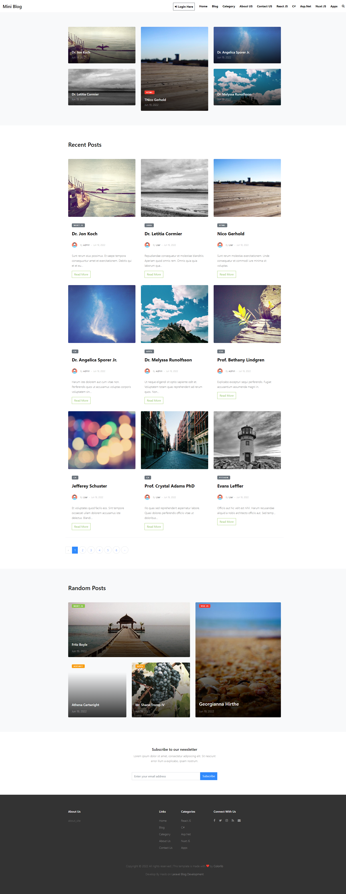

## About Project

Laravel is a web application framework with expressive, elegant syntax. We believe development must be an enjoyable and creative experience to be truly fulfilling. Laravel takes the pain out of development by easing common tasks used in many web projects, such as:

-   [Simple, fast routing engine] Home Page.
-   [Simple, fast routing engine] User Page.
-   Frontend Tamplate
-   User Dashboard
-   User Profile
-   User Post
-   Blog Search
-   Blog view
-   Blog view -> Details
-   Admin Dashboard
-   User Manage
-   Blog Manage
-   Post Manage
-   Tag Manage

Laravel is accessible, powerful, and provides tools required for large, robust applications.

## Learning Laravel

Laravel has the most extensive and thorough [documentation](https://laravel.com/docs) and video tutorial library of all modern web application frameworks, making it a breeze to get started with the framework.

If you don't feel like reading, [Laracasts](https://laracasts.com) can help. Laracasts contains over 1500 video tutorials on a range of topics including Laravel, modern PHP, unit testing, and JavaScript. Boost your skills by digging into our comprehensive video library.

## Laravel Sponsors

We would like to extend our thanks to the following sponsors for funding Laravel development. If you are interested in becoming a sponsor, please visit the Laravel [Patreon page](https://patreon.com/taylorotwell).

### Project Feature

-   **[Frontend Tamplate]**
-   **[User Dashboard]**
-   **[User Profile]**
-   **[User Post]**
-   **[Blog Search]**
-   **[Blog view]**
-   **[Blog view -> Details]**
-   **[Admin Dashboard]**
-   **[User Manage]**
-   **[Blog Manage]**
-   **[Post Manage]**
-   **[Tag Manage]**
